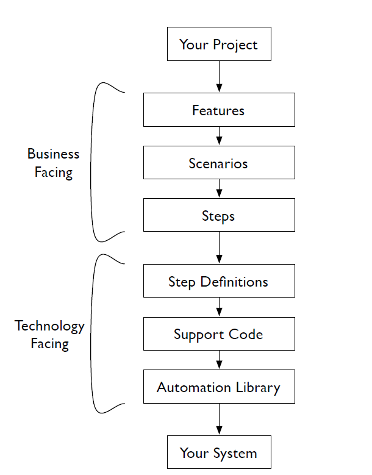
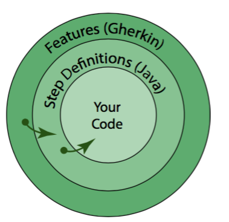
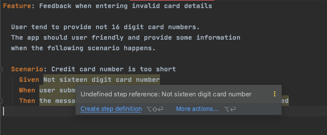
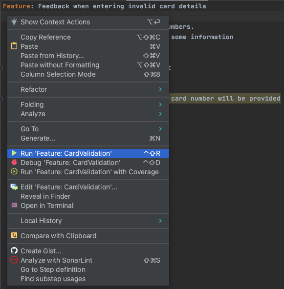
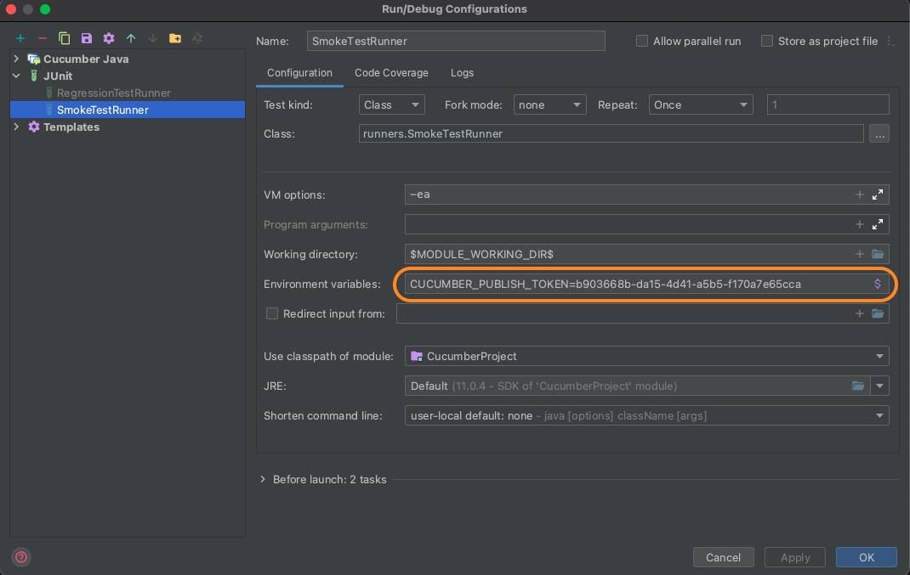

# Cucumber

This is the living documentation for housing notes on [Cucumber](https://cucumber.io/docs/cucumber/api/).

---

#### Table of contents

  * [Installation](#installation)
    + [TestNG/JUnit](#testng-junit)
    + [IDE Plugins](#ide-plugins)
  * [Introduction](#introduction)
    + [What is Cucumber?](#what-is-cucumber-)
    + [Why Cucumber?](#why-cucumber-)
    + [How Cucumber works?](#how-cucumber-works-)
  * [Terminology](#terminology)
  * [Gherkin](#gherkin)
    + [Keywords](#keywords)
      - [**Feature**](#--feature--)
      - [**Background**](#--background--)
      - [**Scenario**](#--scenario--)
      - [**Given, When, Then**](#--given--when--then--)
      - [**And, But**](#--and--but--)
      - [**An asterisk**](#--an-asterisk--)
      - [**Scenario Outline**](#--scenario-outline--)
      - [**Examples**](#--examples--)
  * [Feature files](#feature-files)
  * [Step definitions](#step-definitions)
  * [Comments](#comments)
  * [Descriptions](#descriptions)
  * [Parameter types](#parameter-types)
  * [Hooks](#hooks)
  * [Data Tables](#data-tables)
  * [DataTable Conversions](#datatable-conversions)
    + [Most useful conversions](#most-useful-conversions)
    + [Conversion to object](#conversion-to-object)
  * [Runners](#runners)
  * [Cucumber Options](#cucumber-options)
  * [Reporting](#reporting)
    + [Pretty report](#pretty-report)
    + [Cucumber Report Output](#cucumber-report-output)
    + [Cucumber IO Reports](#cucumber-io-reports)
  * [Staying Organized with Tags and Subfolders](#staying-organized-with-tags-and-subfolders)
    + [Tags](#tags)
    + [Use of tags in Runner classes](#use-of-tags-in-runner-classes)
  * [Imperative vs Declarative style](#imperative-vs-declarative-style)
  * [Exceptions](#exceptions)
  * [Troubleshooting](#troubleshooting)

## Installation

Cucumber-JVM is published in the central Maven repository. You can install it by adding dependencies to your project.

### TestNG/JUnit

Cucumber does not come with an assertion library. Instead, use the assertion methods from a unit testing tool.

In this framework we are using the following versions of `Cucumber` and `JUnit 5`:

- Cucumber - `6.10.4`
- JUnit 5 - `5.7.0`

**Why do we need combination of Cucumber and JUnit/TestNG?**

Cucumber is a Wrapper that creates extra layer for non-technical (PO, Stakeholders).
JUnit/TestNG is a testing framework that allows to run your tests. 

>**NOTE**: Cucumber also compatible with TestNG but you either will use JUnit or TestNG, not both at the same time.

### IDE Plugins

Needs to be installed:

- `Cucumber Java`
- `Gherkin`

## Introduction

### What is Cucumber? 

Cucumber is a software tool that supports behavior-driven development (BDD). ... As such, Cucumber allows the execution of feature documentation written in business-facing text. It is often used for testing other software. It runs automated acceptance tests written in a behavior-driven development (BDD) style.

### Why Cucumber?

Cucumber gives the business, developers and testers a way to collaborate and specify, in plain English, how the app should work.
It's more than automation tool. It's a collaboration tool.

### How Cucumber works?





## Terminology

- Behavior Driven Development (BDD)
    - `Given` - precondition / `Arrange`
    - `When` - action / `Act` (use of the function under test)
    - `Then` - result / `Assert`
- Gherkin language - must-follow set of rules to make Cucumber understand you
- Feature (i.e. sign in feature)
- Feature file - it is a file that will contain scenarios in a Plain English (Gherkin language)
- Scenario (= test case)
- Step definitions (the automation script/code)
- Regex (regular expression)

## Gherkin

Cucumber tests are expressed using a syntax called [Gherkin](https://cucumber.io/docs/gherkin/reference/). Gherkin files are plain text and have a `.feature` extension. 

### Keywords

#### **Feature**

Each Gherkin file begins with the Feature keyword. This keyword doesn’t really affect the behavior of your Cucumber tests at all; it just gives you a convenient place to put some summary documentation about the group of tests that follow.

The following template can be a great place to start feature summary:

```text
In order to <meet some goal> 
As a <type of stakeholder>
I want <a feature>
```

#### **Background**

_Just Like `@BeforeEach` in JUnit_

A background section in a feature file allows you to specify a set of steps that are common to every scenario in the file. 
The `Background` defines the common precondition context.
Instead of having to repeat those steps over and over for each scenario, you move them up into a Background element. Here are a couple of advantages to doing this:

- If you ever need to change those steps, you have to change them in only one place.
- The importance of those steps fades into the background so that when you’re reading each individual scenario, you can focus on what is unique and important about that scenario.

```gherkin
Feature: Change PIN
  As soon as the bank issues new cards to customers, they are
  supplied with a Personal Identification Number (PIN) that
  is randomly generated by the system.
  
  In order to be able to change it to something they can easily
  remember, customers with new bank cards need to be able to
  change their PIN using the ATM.
  
  Background:
    Given I have been issued a new card
    And I insert the card, entering the correct PIN 
    And I choose "Change PIN" from the menu
  
  Scenario: Change PIN successfully
    When I change the PIN to 9876
    Then the system should remember my PIN is now 9876
  
  Scenario: Try to change PIN to the same as before
    When I try to change the PIN to the original PIN number 
    Then I should see a warning message
    And the system should not have changed my PIN
```

#### **Scenario**
    
- Each scenario tells a little story describing something that the system should be able to do.
- Each scenario must make sense and be able to be executed independently of any other scenario.
- Just like a Feature, a Scenario keyword can be followed by a name and description

#### **Given, When, Then**

In Gherkin, we use the keywords `Given`, `When`, and `Then` to identify those three different parts of the scenario:

```gherkin
Scenario: Successful withdrawal from an account in credit 
    Given I have $100 in my account # the context
    When I request $20 # the event(s)
    Then $20 should be dispensed # the outcome(s)
```

#### **And, But**

Each of the lines in a scenario is known as a step. We can add more steps to each Given, When, or Then section of the scenario using the keywords And and But:

```gherkin
Scenario: Attempt withdrawal using stolen card 
    Given I have $100 in my account
    But my card is invalid
    When I request $50
    Then my card should not be returned
    And I should be told to contact the bank
```

If you don’t want to use And or But, you could write the previous scenario like this, and it would still work exactly the same way:
    
```gherkin
Scenario: Attempt withdrawal using stolen card 
    Given I have $100 in my account
    Given my card is invalid
    When I request $50
    Then my card should not be returned
    Then I should be told to contact the bank
```
    
#### **An asterisk**

Replacing Given/When/Then with Bullets `*` (an asterisk).

```gherkin
Scenario: Attempt withdrawal using stolen card 
    * I have $100 in my account
    * my card is invalid
    * I request $50
    * my card should not be returned
    * I should be told to contact the bank
```

It’s up to you and your team how you want to word things. The only thing that matters is that everybody understands what’s communicated.

#### **Scenario Outline**

The `Scenario Outline` keyword can be used to run the same `Scenario` multiple times, with different combinations of values.

The keyword `Scenario Template` is a synonym of the keyword `Scenario Outline`.

`< >` -delimited parameters

A `Scenario Outline` must contain an [Examples](#examples) (or `Scenarios`) section. 

```gherkin
Scenario Outline: eating
  Given there are <start> cucumbers
  When I eat <eat> cucumbers
  Then I should have <left> cucumbers

  Examples:
    | start | eat | left |
    |    12 |   5 |    7 |
    |    20 |   5 |   15 |
```

#### **Examples**

Examples tables should be part of  `Scenario Outline` or `Scenario Template`.

The keyword `Scenarios` is a synonym of the keyword `Examples`.

**Multiple Tables of `Examples`**

```gherkin
Scenario Outline: Withdraw fixed amount
    Given I have <Balance> in my account
    When I choose to withdraw the fixed amount of <Withdrawal> Then I should <Outcome>
    And the balance of my account should be <Remaining>

    Examples: Successful withdrawal
        | Balance | Withdrawal  | Outcome             | Remaining |
        | $500    | $50         | receive $50 cash    | 450$      |
        | $500    | $100        | receive $100 cash   | 400$      |

    Examples: Attempt to withdraw too much
        | Balance | Withdrawal  | Outcome               | Remaining |
        | $100    | $200        | see an error message  | $100      | 
        | $0      | $50         | see an error message  | $0        |
```

## Feature files

_Living Documentation_

The Cucumber feature files are the definitive source of truth as to what the system does. Having a single place to go for this information saves a lot of time that is often wasted trying to keep requirements, documents, tests, and code all in sync.

To illustrate this, let’s imagine you’re building a credit card payment system. One of the requirements is to make sure users can’t enter bad data. Here’s one way of expressing that:

```gherkin
Feature: Feedback when entering invalid card details

  User tend to provide not 16 digit card numbers.
  The app should user friendly and provide some information
  when the following scenario happens.

  Scenario: Credit card number is too short
    Given Not sixteen digit card number
    When user submits the request
    Then the message advising to check the card number will be provided
```

## Step definitions

Each Gherkin scenario is made up of a series of steps, written in plain language. On its own, a step is just documentation; it needs a [step definitions](https://cucumber.io/docs/cucumber/step-definitions/) to bring it to life.

Cucumber allows to reuse the same exactly step definition for different feature files with same step. That reduces duplication of your code.

**How to generate step defs?**

2 ways of generating step definitions out of .feature files:

- IDE generator



- Run feature file and copy steps from console


 
## Comments

Comments start with a `#` character and have to be the first and only thing on a line (well, apart from whitespace).

```gherkin
# This feature covers the account transaction and hardware-driver modules
Feature: Withdraw Cash
    In order to buy beer
    As an account holder
    I want to withdraw cash from the ATM
    
    # Can't figure out how to integrate with magic wand interface
    Scenario: Withdraw too much from an account in credit 
        Given I have $50 in my account
        # When I wave my magic wand
        And I withdraw $100
        Then I should receive $100
```

## Descriptions

Free-form descriptions (as described above for [Feature](#feature)) can also be placed underneath `Example`/`Scenario`, `Background`, `Scenario Outline`.

You can write anything you like, as long as no line starts with a keyword.
 
## Parameter types

Text between curly braces reference a _parameter type_. Cucumber comes with the following built-in [parameter types](https://cucumber.io/docs/cucumber/cucumber-expressions/):

- `{int}`
- `{float}`
- `{word}`
- `{string}`
- `{}`

Example:

```gherkin
# This feature covers the account transaction and hardware-driver modules
Feature: Withdraw Cash
  In order to buy beer
  As an account holder
  I want to withdraw cash from the ATM

  Scenario: Withdraw too much from an account in credit
    Given I have 50 dollars in my account
    When I withdraw 100 dollars
    Then I get system message "Insufficient funds"
```

The generated code will have arguments defined:

```java
@Given("I have {int} dollars in my account")
public void i_have_dollars_in_my_account(Integer accountBalance) {
    System.out.println("I have " + accountBalance + " dollars in my account");
}

@When("I withdraw {int} dollars")
public void i_withdraw_dollars(Integer withdrawAmount) {
    System.out.println("I withdraw " + withdrawAmount + " dollars");
}

@Then("I get the money withdrawn")
public void i_get_the_money_withdrawn() {
    System.out.println("I get the money cashed out");
}
```

## Hooks

```java
@Before
public void beforeEachScenarioHook(){
    System.out.println("Refreshing page before each scenario");
}

@After
public void afterEachScenarioHook(){
    System.out.println("Gather some report of test run");
}
```

To execute the hooks only for particular `Scenario`/`Feature` use [Tags](#tags)

```java
@After(value="@bookstore")
public void afterScenario() {
    // clean up the data
    bookStore = new BookStore();
}
```

## Data Tables

Sometimes steps in a scenario need to describe data that doesn’t easily fit on a single line of Given, When, or Then. Gherkin allows us to place these details in a table right underneath a step.

DataTable is a simple data structure that allows the use and transformation of Gherkin data tables in Cucumber.

This intended to support:

- manual conversion in step definitions
- automatic conversion by Cucumber

[DataTableAPI Reference](https://github.com/cucumber/common/tree/main/datatable)

```gherkin
Given a User "Michael Jackson" born on August 29, 1958 
And a User "Elvis" born on January 8, 1935
And a User "John Lennon" born on October 9, 1940
```

Data tables give you a way to extend a Gherkin step beyond a single line to include a larger piece of data.

```gherkin
Given these Users:
    | name            | date of birth   | 
    | Michael Jackson | August 29, 1958 | 
    | Elvis           | January 8, 1935 | 
    | John Lennon     | October 9, 1940 |
```

Data table above will generate the following step definition:

```java
@Given("these Users:")
public void these_users(io.cucumber.datatable.DataTable dataTable) {
    // Write code here that turns the phrase above into concrete actions
    // For automatic transformation, change DataTable to one of
    // E, List<E>, List<List<E>>, List<Map<K,V>>, Map<K,V> or
    // Map<K, List<V>>. E,K,V must be a String, Integer, Float,
    // Double, Byte, Short, Long, BigInteger or BigDecimal.
    //
    // For other transformations you can register a DataTableType.
    throw new io.cucumber.java.PendingException();
}
```

## DataTable Conversions

The `io.cucumber.datatable.DataTable` is a really rich object with lots of methods for interacting with its data.

### Most useful conversions

Under the hood, the table is just a List of Lists of Strings: `List<List<String>>`. 

```java
@Given("these Users:")
public void these_users(DataTable dataTable) {

    System.out.printf("Print out the raw datatable: \n%s", dataTable);

    // "Conversion to the List of lists:");
    List<List<String>> listOfLists = dataTable.asLists();

    // "Conversion to the List of lists  with providing a type:");
    List<List<Object>> listOfLists2 = dataTable.asLists(String.class);

    // "Conversion to the List of Maps:");
    List<Map<String, String>> listOfMaps = dataTable.asMaps();

    // "Conversion to the Map:");
    Map<String, String> map = dataTable.asMap(String.class, String.class);

    // "Transposed DataTable: \n");
    DataTable transposedDataTable = dataTable.transpose();

}
```

### Conversion to object

There is a way to convert DataTable to the object. 

Parameter types let you convert parameters from cucumber-expressions to objects ([resource](https://cucumber.io/docs/cucumber/configuration/)).

```gherkin
Scenario: Correct non-zero number of books found by author by list
    Given I have the following books in the store by list
      | title                                | author      |
      | The Devil in the White City          | Erik Larson |
      | The Lion, the Witch and the Wardrobe | C.S. Lewis  |
      | In the Garden of Beasts              | Erik Larson |
    When I search for books by author "Erik Larson"
    Then I find 2 books
```

The above `DataTable` is convertible to the list of `Book` objects. 

**How we do it?** 

1. Generate step defs

2. In this particular case we need to convert data table to the `List<Book> books`.
    
    Use the `asList(<Type>.class)` method:

    ```java
    List<Book> books = dataTable.asList(Book.class);
    ``` 
   
   OR
   
   Instead of using the method for conversion you can provide the parameter of expected type in the method signature:
   
   ```java
   @Given("I have the following books in the store by list")
   public void i_have_the_following_books_in_the_store_by_list(List<Book> books) {
          
       // your code      
   }
   ```

3. Define Type Registry with the help of `@DataTableType` annotation:

    ```java
    @DataTableType
    public Book authorEntry(Map<String, String> entry) {
        return new Book(
                entry.get("title"),
                entry.get("author"));
    }
    ```

## Runners

```java
@RunWith(Cucumber.class)
@CucumberOptions(
        features = {"classpath:features"}, // will point to the feature files in resources folder
        glue = {"org.example.step_defs"} // will point to the java code -> step definitions 
)
public class SmokeTestRunner {
}
```

## Cucumber Options

`@CucumberOptions` are like property files or settings for your test. Basically `@CucumberOptions` enables us to do all the things that we could have done if we have used cucumber command line. 

**Features**

Features Options helps Cucumber to locate the Feature file in the project folder structure. All we need to do is to specify the folder path and Cucumber will automatically find all the '.features' extension files in the folder. 

- It can be specified like:

  `features = "features"`

- Or if the Feature file is in the deep folder structure

  `features = "src/test/features"`

- If only one particular feature file, it should be like this

  `features = "classpath:features/DEV/SmokeTests.feature"`

>**NOTE**: In this framework we placed feature files in `test/resources/features`, hence use `features = "classpath:features"`.

**Glue**

It is almost the same think as Features Option but the only difference is that it helps Cucumber to locate the Step Definition file. Whenever Cucumber encounters a Step, it looks for a Step Definition inside all the files present in the folder mentioned in Glue Option. 

- It can be specified like:

  `glue = "stepDefinition"`

- Or if the Step Definition file is in the deep folder structure

  `glue = "org/example/step_defs"`

**Dry Run**

`dryRun` option can either set as `true` or `false`. If it is set as `true`, it means that Cucumber will only check that every Step mentioned in the `Feature File` has corresponding code written in `Step Definition` file or not. So in case any of the functions are missed in the `Step Definition` for any `Step` in `Feature File`, it will give us the message.

```java
@RunWith(Cucumber.class)
@CucumberOptions(
        features = {"classpath:features"},
        glue = {"org.example.step_defs"},
        dryRun = true
)
public class SmokeTestRunner {
}
```

**Monochrome**

This option can either set as true or false. If it is set as true, it means that the console output for the Cucumber test are much more readable. And if it is set as false, then the console output is not as readable as it should be.

```java
@RunWith(Cucumber.class)
@CucumberOptions(
        features = {"classpath:features"},
        glue = {"org.example.step_defs"},
        monochrome=true
)
public class SmokeTestRunner {
}
```

## Reporting

>**NOTE**: Suggestion to look into the Allure Reports & Extent Reports

### Pretty Report

The first plugin, we will talk about is Pretty. This provides more verbose output. To implement this, just specify plugin = "pretty" in `CucumberOptions`. This is what the code looks like:

`@CucumberOptions( plugin = { "pretty" } )`

### Cucumber Report Output

Cucumber gives us the capability to generate reports as well in the form of HTML, XML, JSON & TXT. Cucumber frameworks generate very good and detailed reports, which can be shared with all stakeholders. There are multiple options available for reports which can be used depending on the requirement.

```java
@CucumberOptions(
        plugin = {
                "pretty", 
                "html:target/Cucumber.html", 
                "json:target/Cucumber.json",
                "junit:target/Cucumber.xml"}
)
```

>**NOTE**: The JSON or XML format report is meant to be post processed into another visual format by third-party tools, such as Jenkins.

### Cucumber Extent Report

TODO

### Cucumber IO Reports

[Resource](https://reports.cucumber.io/)

```shell script
┌───────────────────────────────────────────────────────────────────────────────────┐
│ Share your Cucumber Report with your team at https://reports.cucumber.io          │
│ Activate publishing with one of the following:                                    │
│                                                                                   │
│ src/test/resources/cucumber.properties:          cucumber.publish.enabled=true    │
│ src/test/resources/junit-platform.properties:    cucumber.publish.enabled=true    │
│ Environment variable:                            CUCUMBER_PUBLISH_ENABLED=true    │
│ JUnit:                                           @CucumberOptions(publish = true) │
│                                                                                   │
│ More information at https://reports.cucumber.io/docs/cucumber-jvm                 │
│                                                                                   │
│ Disable this message with one of the following:                                   │
│                                                                                   │
│ src/test/resources/cucumber.properties:          cucumber.publish.quiet=true      │
│ src/test/resources/junit-platform.properties:    cucumber.publish.quiet=true      │
└───────────────────────────────────────────────────────────────────────────────────┘
```

- Go to https://reports.cucumber.io 
- Sign in using github account
- Create a new collection `CucumberProject`
- Publish reports to this collection by defining an environment variable before running Cucumber:
  
  For MacOS:
  
  ```shell script
  $ export CUCUMBER_PUBLISH_TOKEN=some_token
  ```
  
  For the rest of the OS follow instructions about how to [define environment variables](how to define environment variables).

  OR
  
  Add environment variable in configurations:
  
  
  
**How to enable publishing?**

`@CucumberOptions(publish = true)`

After running the cucumber suite you will get the following output on console:

```shell script
┌──────────────────────────────────────────────────────────────────────────┐
│ View your Cucumber Report at:                                            │
│ https://reports.cucumber.io/reports/ff570113-9727-4d06-b1f4-f0b363977a73 │
│                                                                          │
│ This report will self-destruct in 24h.                                   │
│ Keep reports forever: https://reports.cucumber.io/profile                │

Process finished with exit code 255
└──────────────────────────────────────────────────────────────────────────┘
```

OR saved in the collection you have created

```shell script
┌──────────────────────────────────────────────────────────────────────────┐
│ View your Cucumber Report at:                                            │
│ https://reports.cucumber.io/reports/e519aebe-ed21-418b-841a-01dfd23cbe7c │
│                                                                          │
│ This report was published in collection "CucumberProject"                │

Process finished with exit code 0
└──────────────────────────────────────────────────────────────────────────┘
```

You can open the link and check the results.

## Staying Organized with Tags and Subfolders

### Tags

If subfolders are the chapters in your book of features, then tags are the sticky notes you’ve put on pages you want to be able to find easily. 

You tag a scenario by putting a word prefixed with the `@` character on the line before the `Scenario` keyword.

If you want to tag all the scenarios in a feature at once, just tag the Feature element at the top, and all the scenarios will inherit the tag. You can still tag individual scenarios as well.

```gherkin
@bookstore @regression
Feature: Book Store

  @ignore
  Scenario: Correct non-zero number of books found by author by list
    Given I have the following books in the store by list
      | title                                | author      |
      | The Devil in the White City          | Erik Larson |
      | The Lion, the Witch and the Wardrobe | C.S. Lewis  |
      | In the Garden of Beasts              | Erik Larson |
    When I search for books by author "Erik Larson"
    Then I find 2 books

  @smoke
  Scenario: Correct non-zero number of books found by title pattern by list
    Given I have the following books in the store by list
      | title                                | author      |
      | The Devil in the White City          | Erik Larson |
      | The Lion, the Witch and the Wardrobe | C.S. Lewis  |
      | In the Garden of Beasts              | Erik Larson |
      | Beasts                               | John Doe    |
    When I search for books by title pattern "Beast"
    Then I find 2 books
```

You can attach multiple tags to the same scenario.

### Use of tags in Runner classes

Replace `{tag(s)}` below in Runner with the examples below:

```java
@RunWith(Cucumber.class)
@CucumberOptions(
        features = {"classpath:features"},
        glue = {"org.example.step_defs"},
        tags = "{tag(s)}"
)
public class SmokeTestRunner {
}
```

Examples:

- `tags = "@smoke"` will run tests with `@smoke` tag only

- `tags = "@smoke and @transactions"` will run tests that have both `@smoke` AND `@transactions` tags at the same time

- `tags = "@smoke or @transactions"` will run tests that have `@smoke` OR `@transactions` tags

- `tags = "not @ignore"` will run ALL test besides tests with `@ignore` tag

- `tags = "@smoke or @transactions and not @ignore"` will run ALL tests besides tests with `@ignore` tag

## Imperative vs Declarative style

Extra to learn on your own.

## Exceptions

-   `AmbiguousStepDefinitionsException`

    Reason: The first regexp matches everything that the second regexp does, so any step that matches the second regexp will match both and cause this error.

    ```shell script
    Step failed
    io.cucumber.core.runner.AmbiguousStepDefinitionsException: "user submits the request" matches more than one step definition:
      "^user submits the request" in org.example.step_defs.MyStepdefs.user_submits_the_request()
      "user submits the request" in org.example.step_defs.CardValidationSteps.user_submits_the_request()
    ```
  
-   `FeatureParserException`

    When steps are not generated after running feature file.

    Reason: You might missing `Scenario` keyword in your feature file. Check your feature file.

    ```shell script
    Exception in thread "main" io.cucumber.core.gherkin.FeatureParserException: Failed to parse resource at: file:/path-to-project/CucumberProject-master/src/test/resources/features/FlightAware.feature
    ```
    
    OR
    
    ```shell script
    Exception in thread "main" java.lang.IllegalArgumentException
    ```
    
-   `CucumberException: Could not invoke step`

    Reason: The data type identified doesn't match data type of the param in your method signature.

    ```shell script
    Step failed
    io.cucumber.core.exception.CucumberException: Could not invoke step [I have {double} dollars in my account] defined at 'org.example.step_defs.ArgumentsExampleSteps.i_have_dollars_in_my_account(java.lang.Integer)'.
    It appears there was a problem with the step definition.
    The converted arguments types were (java.lang.Double)
    ```
   
    Example:
    
    ```java
    @Given("I have {double} dollars in my account")
    public void i_have_dollars_in_my_account(Integer accountBalance) {
        System.out.println("I have " + accountBalance + " dollars in my account");
    }
    ```

-   `UndefinedDataTableTypeException`

    Reason: If you are not providing the `@DataTableType`
  
    ```shell script
    Step failed
    io.cucumber.datatable.UndefinedDataTableTypeException: Can't convert DataTable to List<org.example.models.Book>.
    Please review these problems:
    
    - There was no table entry or table row transformer registered for org.example.models.Book.
     Please consider registering a table entry or row transformer.
    
    - There was no default table entry transformer registered to transform org.example.models.Book.
     Please consider registering a default table entry transformer.
    
    Note: Usually solving one is enough
      at io.cucumber.datatable.UndefinedDataTableTypeException.listNoConverterDefined(UndefinedDataTableTypeException.java:110)
      at io.cucumber.datatable.DataTableTypeRegistryTableConverter.toList(DataTableTypeRegistryTableConverter.java:144)
      at io.cucumber.datatable.DataTable.asList(DataTable.java:181)
      at org.example.step_defs.BookStoreSteps.i_have_the_following_books_in_the_store_by_list(BookStoreSteps.java:23)
    ```

## Troubleshooting

-   If you have the following output:

    `Error:java: invalid source release: 11`

    Remove the following from properties tag in pom.xml if you have it

    ```xml
    <maven.compiler.source>${java.version}</maven.compiler.source>
    <maven.compiler.target>${java.version}</maven.compiler.target>
    ```